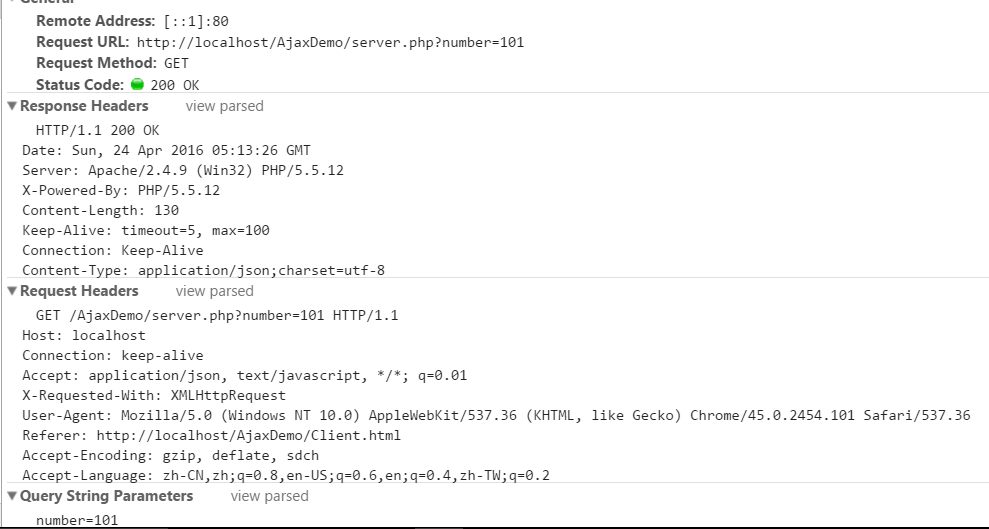

#### XMLHttpRequest对象


```
var request = new XMLHttpRequest();
```

#### Http请求

http能浏览器从服务器请求信息和服务，是一种无状态协议（不建立持久链接）

HTTP请求过程：
- 建立TCP链接
- Web浏览器向Web服务器发送请求命令
- Web浏览器发送请求的头信息
- Web服务器应答
- Web服务器发送应答头信息
- Web服务器向Web浏览器发送数据
- Web浏览器关闭TCP连接
 

#### Http请求
包含四部分：
- HTTP请求方法或动作，比如是GET还是POST
- 请求的URL
- 请求头，包含一些客户端环境信息，身份验证信息等
- 请求体，（请求正文）包含客户端提交的查询字符串信息，表单信息




GET请求
- 一般用于信息获取
- 发送信息数量有限制
- 使用URL传递参数

POST请求
- 一般用于修改服务器上资源
- 发送信息数量无限制
- 参数嵌入请求体中

#### Http响应
包含三部分：

- 状态码，数字和文字组成，显示请求是成功还是失败
- 响应头
- 响应体


#### Http状态码

状态码由三位数字组成

- 1**：收到浏览器请求，正在处理
- 2**：成功，用户请求被正确接收
- 3**：重定向，请求没有成功，客户必须采取进一步动作
- 4**：客户端错误，客户端提交的请求有误
- 5**：服务器错误，服务器不能完成对请求的处理


js实现get请求

```
document.getElementById("search").onclick = function(){
    var request = new XMLHttpRequest();
    request.open("GET","server.php?number=" + document.getElementById("keyword").value);
    request.send();      //发送请求
    request.onreadystatechange = function(){    //监听事件 监听服务器xhr对象readyState改变

        //判断请求是否结束
        if(request.readyState === 4){
            //判断请求是否成功
            if(request.status === 200) {

                var data = JSON.parse(request.responseText);
                //判断请求逻辑是否正确
                if(data.success){
                    document.getElementById("searchResult").innerHTML = data.msg;
                }else{
                    document.getElementById("searchResult").innerHTML = "错误是：" + data.msg;
                }

            }else{
                alert('error:' + request.status)
            }
        }
    }
};
```

js实现post请求

```
document.getElementById("save").onclick = function(){
    var data = "number=" + document.getElementById("staffNumber").value +
                "&sex=" + document.getElementById("staffSex").value +
                "&name=" + document.getElementById("staffName").value +
                "&job=" + document.getElementById("staffJob").value;

    var request = new XMLHttpRequest();
    request.open("POST","server.php?");
    request.setRequestHeader("Content-Type","application/x-www-form-urlencoded");
    request.send(data);      //发送请求

    request.onreadystatechange = function(){    //监听事件 监听服务器xhr对象readyState改变

        //判断请求是否结束
        if(request.readyState === 4){
            //判断请求是否成功
            if(request.status === 200) {

                var data = JSON.parse(request.responseText);
                //判断请求逻辑是否正确
                if(data.success){
                    document.getElementById("createResult").innerHTML = data.msg;
                }else{
                    document.getElementById("createResult").innerHTML = "错误是：" + data.msg;
                }

            }else{
                alert('error:' + request.status)
            }
        }
    }
}
```

jquery实现get请求

```
$('#search').on('click',function(){

    $.ajax({
        type:"GET",
        url:"server.php?number=" + $('#keyword').val(),
        data:",
        dataType:"json",
        success:function(data){
            //判断请求逻辑是否正确
            if(data.success){
                $('#searchResult').html(data.msg);
            }else{
                $('#searchResult').html("错误是："+data.msg);
            }
        },
        error:function(xhr){
            alert('error:' + xhr.status)
        }
    })
});
```

jquery实现post请求

```
$('#save').on('click',function(){

    $.ajax({
        type:"POST",
        url:"server.php",
        data:{
            number:$("#staffNumber").val(),
            sex:$("#staffSex").val(),
            name:$("#staffName").val(),
            job:$("#staffJob").val()
        },
        dataType:"json",
        success:function(data){
            //判断请求逻辑是否正确
            if(data.success){
                $('#createResult').html(data.msg);
            }else{
                $('#createResult').html("错误是："+data.msg);
            }
        },
        error:function(xhr){
            alert('error:' + xhr.status)
        }
    })
})
```


## JSON

JSON(javascript Object Notation)是javascript对象表示法，采用键值对的方式来组织，名称/值对（名称要有引号）

JSON的值可以是
- 数字
- 字符串（双引号中）
- 逻辑值
- 数组（方括号中）
- 对象（花括号中）
- null

```
{
    "staff":[
        {"name":"洪七","number":"101","sex":"男","job":"总经理"},
        {"name":"郭靖","number":"102","sex":"男","job":"总经理"},
        {"name":"黄蓉","number":"103","sex":"男","job":"总经理"}
    ]
}
```
一个大的JSON对象，里面有一个属性值对，值是一个数组，数组里又有三个JSON对象。

#### JSON的解析

eval()，不仅解析了JSON而且会执行JSON中的一些方法。
```
var jsondata = '{"staff":[{"name":"洪七","number":101,"sex":"男","job":"总经理"},{"name":"郭靖","number":102,"sex":"男","job":"总经理"},{"name":"黄蓉","number":103,"sex":"女","job":"总经理"}]}'
var jsonobj = eval('('+jsondata+')')
jsonobj.staff[0].name               //"洪七"
```
json.parse()
```
var jsondata = '{"staff":[{"name":"洪七","number":101,"sex":"男","job":"总经理"},{"name":"郭靖","number":102,"sex":"男","job":"总经理"},{"name":"黄蓉","number":103,"sex":"女","job":"总经理"}]}'
var jsonobj = json.parse(jsondata)
jsonobj.staff[0].name               //"洪七"
```

